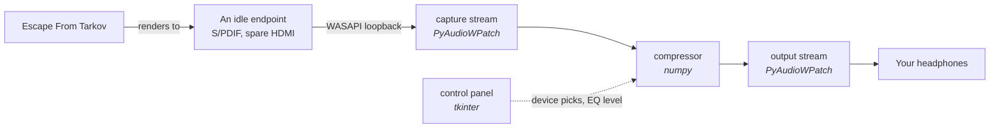

# PyTarkAudio

Hear the small things.

A dynamic range squasher for Escape From Tarkov. It sits between the game and your headphones,
pushes loud sounds down and pulls faint ones up, so a footstep behind a wall lands at close to
the same loudness as the gun in your hands.

No injection, no memory reading, no game files touched. It taps a Windows playback endpoint the
same way a recording app would.


## How it works

Windows has no built in virtual audio device, so the only way to get between the game and your
ears is to have the game render somewhere you are not listening, and to relay that somewhere you
are. Tools like VoiceMeeter solve this by installing a driver. This one borrows an endpoint you
already have and are not using, so there is nothing extra to install.



| Piece | What it is | Why |
| --- | --- | --- |
| `audio.py` | PyAudioWPatch + numpy | The capture, the compressor and the playback. |
| `gui/app.py` | tkinter, stdlib only | The window. No widget toolkit, no theming library. |
| `scripts/make_icon.py` | cairosvg + Pillow | Turns `gui/pytarkaudio.svg` into the `.ico`. Only needed if you redraw the icon. |
| `scripts/setup_msi.py` | cx_Freeze | Builds the MSI. Only runs in CI, or by hand for a dry run. |

PyAudioWPatch rather than the more usual `sounddevice`, because the PortAudio build behind
`sounddevice` has no WASAPI loopback flag and cannot tap a playback device at all.

Windows only. WASAPI loopback does not exist anywhere else, so there is no macOS or Linux build
and there is not going to be one.

## Download

1. Grab the latest `pytarkaudio-<version>-win64.msi` from Releases.
2. Run the installer, then launch **PyTarkAudio** from the Start menu.
3. Follow [Usage](#usage) to point the game at an idle endpoint. The installer cannot do that
   part for you.

The installer is built by `.github/workflows/release.yml` on `windows-latest` and published when
a `vX.Y.Z` tag is pushed. The tag is the only place a version number lives: nothing in source
holds one, and `scripts/setup_msi.py` only reads the tag to name the artifact. A manual
`workflow_dispatch` run builds the MSI and uploads it as an artifact without minting a release,
so the pipeline can be exercised without shipping anything.

Cutting a release:

```
git tag v0.1.0
git push origin v0.1.0
```

Building one locally, to see what the workflow will produce:

```
pip install cx_Freeze
python scripts/setup_msi.py bdist_msi --target-version v0.0.0-local
```

## Setup

Requires Python 3.11 or newer.

```
git clone https://github.com/matthewmiglio/PyTarkAudio.git
cd PyTarkAudio
```

```
pip install -r requirements.txt
python main.py
```

That is the whole install. `cairosvg` and `cx_Freeze` are only needed if you want to regenerate
the icon or build an installer, and the `.ico` is committed, so you do not.

Check the compressor is behaving without opening the window:

```
python audio.py
```

It prints what each level does to a loud sound and a quiet one, and fails loudly if the maths
has drifted.

## Usage

### Once, in Windows

Something has to send the game's audio somewhere you are not listening, or you will hear the raw
mix alongside the processed one.

1. Open **Settings > System > Sound > Volume mixer**.
2. Find Tarkov and set its output device to an endpoint you never listen on. A digital output
   with nothing plugged into it, or a monitor's HDMI audio, is ideal.
3. Leave it that way. You never have to change it back.

With the game pointed there and PyTarkAudio not running, Tarkov will be silent. That is the
expected state, not a fault.

### Every time

1. Run `python main.py`, or launch PyTarkAudio from the Start menu if you used the installer.
2. **TARKOV OUTPUT**: the idle endpoint you picked above.
3. **YOUR HEADPHONES**: where you actually listen.
4. **EQ LEVEL**: how hard to squash. Changing it while running takes effect immediately, with no
   gap in the audio.
5. Press **START**. The lamp goes green.

Your picks are saved to `%APPDATA%\PyTarkAudio\settings.json` and come back next launch. A device
that has since been unplugged falls back to a default rather than failing on start.

### The levels

What each one does to a 45 dB gap between a gunshot and a footstep:

| Level | Gap left | Feels like |
| --- | --- | --- |
| Soft | 26 dB | Gunfire still dominates, quiet detail is just easier to catch. |
| Medium | 15 dB | Footsteps and firefights sit in the same range. |
| Aggressive | 7 dB | Almost everything is the same loudness. Loud, flat, and very hard to miss anything. |

Attack is fast enough to catch a gunshot's first crack, release is slow enough that the level
does not pump between shots.

## Known limits

- The compressor is broadband, not multiband. A gunshot's low end drives the whole gain
  reduction, so heavy fire can duck the mids where footsteps live. If that bothers you in
  practice, splitting the detector into bands is the fix.
- Capture and output must run at the same sample rate. WASAPI shared mode will not resample
  between them, and mismatched endpoints raise on start rather than quietly sounding wrong.
