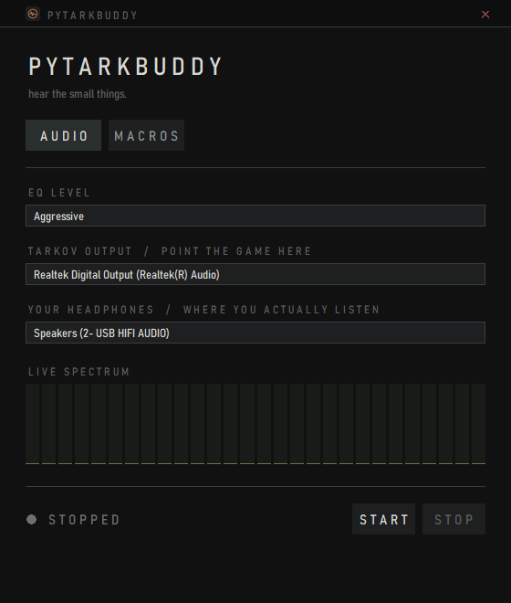
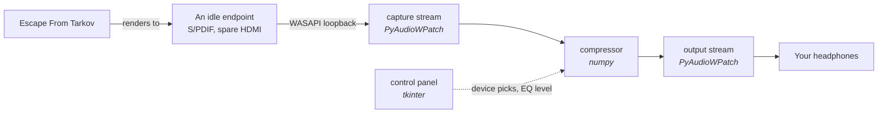
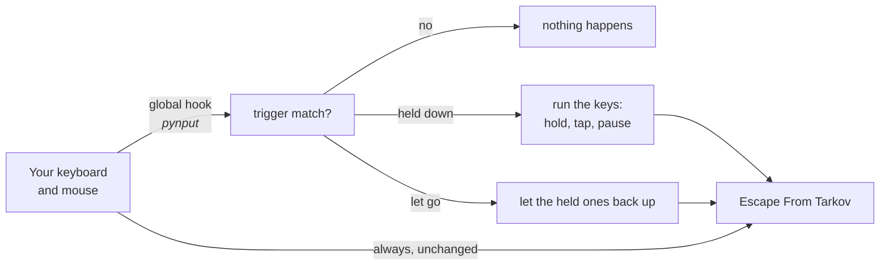

# PyTarkBuddy

Hear the small things.

Two things Escape From Tarkov does not do for you, in one window.

**Audio.** A dynamic range squasher that sits between the game and your headphones, pushing loud
sounds down and pulling faint ones up, so a footstep behind a wall lands at close to the same
loudness as the gun in your hands.

**Macros.** One key or mouse button fires a run of other keys. Each key is either held for as
long as the trigger is, or tapped on the way through, and any key can carry a pause after it.
Bind right mouse to a held `[` and a tapped `]`, or bind `q` to shift, `e`, a tenth of a second,
then `f`. Any key or button, any number of keys.

No injection, no memory reading, no game files touched. The audio side taps a Windows playback
endpoint the same way a recording app would, and the macro side listens for keys the same way a
hotkey utility would.



## How it works

### Audio

Windows has no built in virtual audio device, so the only way to get between the game and your
ears is to have the game render somewhere you are not listening, and to relay that somewhere you
are. Tools like VoiceMeeter solve this by installing a driver. This one borrows an endpoint you
already have and are not using, so there is nothing extra to install.



### Macros

A global hook watches every key and mouse press and release. Press a trigger you have bound and
the keys you recorded are sent in order: a held key goes down and stays down, a tapped key goes
down and straight back up, and a key with a pause on it stops the run there for that long. Let
the trigger go and the held keys come back up, last one down first one up. The tapped ones are
already finished and are left alone.

The trigger is never swallowed. Right mouse still aims; the macro rides along on top of it.



| Piece | What it is | Why |
| --- | --- | --- |
| `audio.py` | PyAudioWPatch + numpy | The capture, the compressor and the playback. |
| `macros.py` | pynput | The key and mouse hooks, and sending keystrokes back out. |
| `gui/app.py` | tkinter, stdlib only | The window and both tabs. No widget toolkit, no theming library. |
| `scripts/make_icon.py` | cairosvg + Pillow | Turns `gui/pytarkbuddy.svg` into the `.ico`. Only needed if you redraw the icon. |
| `scripts/setup_msi.py` | cx_Freeze | Builds the MSI. Only runs in CI, or by hand for a dry run. |

PyAudioWPatch rather than the more usual `sounddevice`, because the PortAudio build behind
`sounddevice` has no WASAPI loopback flag and cannot tap a playback device at all.

Windows only. WASAPI loopback does not exist anywhere else, so there is no macOS or Linux build
and there is not going to be one.

## Download

1. Grab the latest `pytarkbuddy-<version>-win64.msi` from Releases.
2. Run the installer, then launch **PyTarkBuddy** from the Start menu.
3. Follow [Usage](#usage) to point the game at an idle endpoint. The installer cannot do that
   part for you.

The installer is built by `.github/workflows/release.yml` on `windows-latest` and published when
a `vX.Y.Z` tag is pushed. The tag is the only place a version number lives: nothing in source
holds one, and `scripts/setup_msi.py` only reads the tag to name the artifact. A manual
`workflow_dispatch` run builds the MSI and uploads it as an artifact without minting a release,
so the pipeline can be exercised without shipping anything.

Cutting a release:

```
git tag v0.1.0
git push origin v0.1.0
```

Building one locally, to see what the workflow will produce:

```
pip install cx_Freeze
python scripts/setup_msi.py bdist_msi --target-version v0.0.0-local
```

## Setup

Requires Python 3.11 or newer.

```
git clone https://github.com/matthewmiglio/PyTarkBuddy.git
cd PyTarkBuddy
```

```
pip install -r requirements.txt
python main.py
```

That is the whole install. `cairosvg` and `cx_Freeze` are only needed if you want to regenerate
the icon or build an installer, and the `.ico` is committed, so you do not.

Check either half is behaving without opening the window:

```
python audio.py
python macros.py
```

`audio.py` prints what each level does to a loud sound and a quiet one. `macros.py` checks the
key naming and the rows it will and will not listen for. Both fail loudly if the logic has
drifted.

## Usage

### AUDIO

#### Once, in Windows

Something has to send the game's audio somewhere you are not listening, or you will hear the raw
mix alongside the processed one.

1. Open **Settings > System > Sound > Volume mixer**.
2. Find Tarkov and set its output device to an endpoint you never listen on. A digital output
   with nothing plugged into it, or a monitor's HDMI audio, is ideal.
3. Leave it that way. You never have to change it back.

With the game pointed there and PyTarkBuddy not running, Tarkov will be silent. That is the
expected state, not a fault.

#### Every time

1. Run `python main.py`, or launch PyTarkBuddy from the Start menu if you used the installer.
2. **TARKOV OUTPUT**: the idle endpoint you picked above.
3. **YOUR HEADPHONES**: where you actually listen.
4. **EQ LEVEL**: how hard to squash. Changing it while running takes effect immediately, with no
   gap in the audio.
5. Press **START**. The lamp goes green.

#### The levels

What each one does to a 45 dB gap between a gunshot and a footstep:

| Level | Gap left | Feels like |
| --- | --- | --- |
| Off | 45 dB | A real bypass. The audio passes through untouched, and the meter still reads it. |
| Soft | 26 dB | Gunfire still dominates, quiet detail is just easier to catch. |
| Medium | 15 dB | Footsteps and firefights sit in the same range. |
| Aggressive | 7 dB | Almost everything is the same loudness. Loud, flat, and very hard to miss anything. |

Attack is fast enough to catch a gunshot's first crack, release is slow enough that the level
does not pump between shots.

### MACROS

Building one:

1. Press **ADD MACRO**. An empty row appears.
2. Click the left plate, then press the key or mouse button you want as the trigger. Mouse
   buttons show as `L-MOUSE`, `R-MOUSE` and so on.
3. Click the right plate, then type the keys you want it to send, in order. Press **Esc** when
   you are done. Each key you typed becomes its own small plate on the row.
4. Click a key's plate to switch it between held and tapped. A tapped one reads `E TAP`.
5. Right-click a key's plate to put a pause after it, cycling through 0.05, 0.1, 0.25, 0.5 and
   1 second and back to none. A key with a pause reads `E TAP +0.1s`.
6. Press **ON**. The lamp goes green and the macros are live everywhere, including in game.

Hold the trigger and the held keys are held. Let it go and they are released, in reverse order,
so the first one down is the last one up. Tapped keys are pressed and released as the run goes
through them, so they do not wait on the trigger at all.

So `q` bound to a tapped shift, a tapped `e` with a 0.1s pause, then a tapped `f` sends shift and
`e`, waits a tenth of a second, and sends `f`.

**OFF** takes the hooks down, and lets go of anything a macro was still holding rather than
leaving a key stuck down. Closing the window does the same, so nothing is left listening and
nothing is left pressed.

The ✕ at the end of a row deletes it, and the ⟲ next to it records the keys again from scratch.
Recording keys, or changing one, turns the macros off first, so the trigger you are editing
cannot fire while you are editing it.

### Both

Your picks, and every macro, are saved to `%APPDATA%\PyTarkBuddy\settings.json` and come back
next launch. A device that has since been unplugged falls back to a default rather than failing
on start. Macros always start switched off, so a fresh launch never surprises you.

## Known limits

- The compressor is broadband, not multiband. A gunshot's low end drives the whole gain
  reduction, so heavy fire can duck the mids where footsteps live. If that bothers you in
  practice, splitting the detector into bands is the fix.
- Capture and output must run at the same sample rate. WASAPI shared mode will not resample
  between them, and mismatched endpoints raise on start rather than quietly sounding wrong.
- A key is held or tapped once. There is no repeat while held. The pause after a key is picked
  from a short list rather than typed, so 0.05 to 1 second is what you get. `macros.HOLD` is the
  gap between one key going down and the next, and is the knob to turn if a game misses the odd
  keystroke.
- A macro's pauses run while the trigger is being handled, so a long run of pauses is still
  going after a quick tap of the trigger. Letting the trigger go waits its turn rather than
  cutting the run short.
- Esc cannot be recorded into a macro, because it is what ends the recording.
- The macro list does not scroll, so it stops at eight rows.
